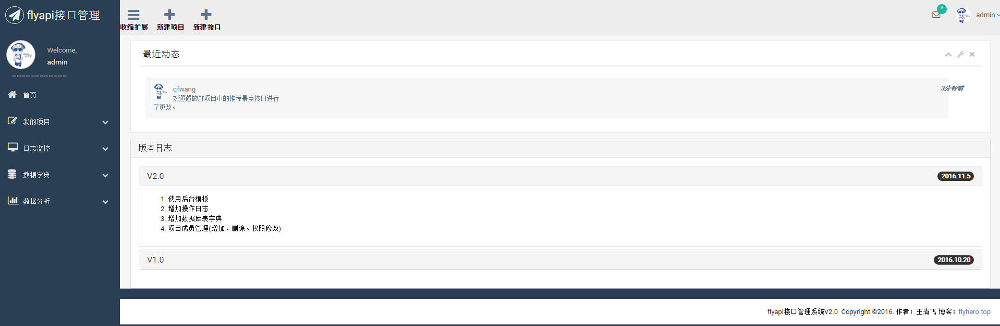
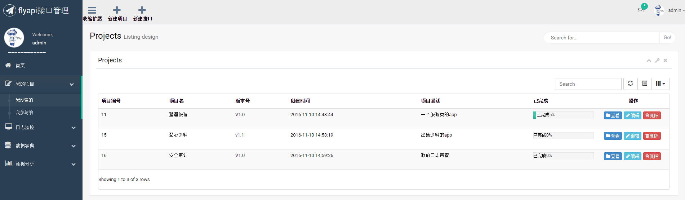

# flyapi2.2.1
接口管理系统 基于SSM+Maven的多模块项目
开发中不必再麻烦的写文档，前后端人员联调会更加方便，通过在线接口管理，前端人员很容易知道后端人员增加、修改了哪些接口，大大减少了联调时间和增加了工作效率。
项目成员可将项目中的接口生成pdf文档，方便保存。

# 项目地址
Github: https://github.com/flyhero/flyapi

# 技术选择
1、后端

- 核心框架：Spring Framework 4.1.7
- 视图框架：Spring MVC 4.1.7
- 持久层框架：MyBatis 3.2.6
- 任务调度：Spring + Quartz 2.2.2
- 分页插件：Mybatis-PageHelper 4.0.0
- 数据库：MySql 5.6
- 数据库连接池：Alibaba Druid 1.0.9
- 日志管理：SLF4J 1.7.7、Log4j
- 即时消息：Spring WebSocket
- 消息队列： Apache ActiveMQ

2、前端

- JS框架：jQuery 1.9
- CSS框架：Twitter Bootstrap 3.3.1
- 客户端验证：Bootstrap-Validator
- 数据表格：Bootstrap-table
- 日期控件： My97DatePicker
- 弹层组件：layer2.4
- 数据可视化：echarts 3
- markdown编辑器: editor.md
- 弹幕插件：jquery.barrager.js

# 演示界面
## 登录页面

## 主页面

## 项目列表

## 即时消息

接下来：
1. 测试接口响应速度
2. 增项目截止日期、删预测接口数
3. 增项目基础路径【测试路径，生产路径】
4. 根据请求参数，生成请求示例
5. 捐赠拥有某些权限【如：最多创建三个项目；不能下载word等】
6. 增加 Apache ActiveMQ 来做消息队列的实现
7. 直播文字[有弹幕]
8. 考虑restful api 调试
9. 可以分产品线，一个产品线可能包含多个项目
10. 使用mock接口提供模拟数据
11.加入需求调查问卷，数据分析
12.二维码生成器
13.捐助榜
14.增加招聘页
15.在线简历页，github登录后生成贡献报告【https://github.com/ecmadao/hacknical】
16.第三方登录【QQ，微信，github】
17.工作日报
18.成长图谱
19.团队技术文章